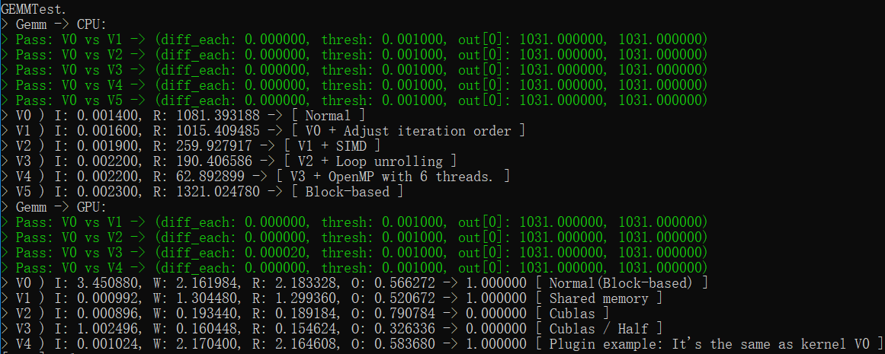

# cux

An eXperimental framework for performance analysis and optimization of CUDA kernel functions.

This framework is designed to help you intuitively know the optimizable space of your own kernel functions, making it easier for you to make further optimizations.

---

## 主要功能

一个CUDA实验框架，主要用于cuda核函数的性能分析与优化实验。

基于该框架，可以根据自己的优化思路编写不同的核函数，加入到其中。由框架自动测试出核函数的输出是否正确，计算出核函数调用过程中每部分的耗时，并与第三方库的同等函数进行对比分析。

可以让你能够快速直观地分析自己所写的核函数准确性和计算效率，便于分析梳理自己编写cuda核函数的思路以及每种优化方法的效果。

## 运行结果图


## 主要模块

1. Executor：调度器，最外层类，管控整个调度逻辑。
2. Operator：操作子的父类，基本的计算与实验单元。每个特定的操作子类都会是Operator的派生类。
3. OpFactory：操作子工厂，以工厂的模式管理所有操作子，协助外部快速构建每个操作子。
4. OpAssistor：辅助器，提供运算过程中所需的相关工具函数，如检查核函数的运算结果。
5. Array4D：数据管理的基本单元，负责内存与显存交互与管理。
6. KernelInterface：用于用户自定义新的核函数。

## 依赖

1. CUDA.
2. googletest，用于单元测试。

## 编译

```bash
cd hpc\0-frameworks\cux
mkdir windows
cd windows
cmake -G "Visual Studio 14 2015" -DCMAKE_GENERATOR_PLATFORM=x64 ..
```